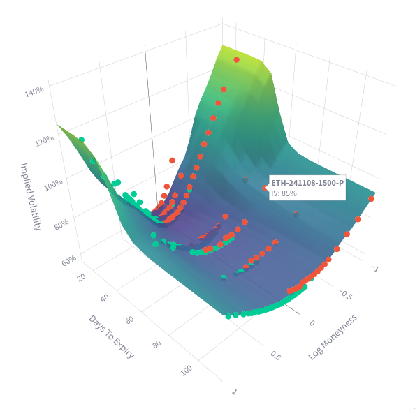

# Crypto Volatility Surface

A dashboard to visualize cryptocurrency implied volatility surfaces constructed with option data from Binance. Built with [Streamlit](https://streamlit.io/).



## Run Locally

```bash
uv run streamlit run app.py
```

If you are in a restricted location and use a proxy to access Binance, set a `BINANCE_PROXY` environment variable.

```bash
# For example:
BINANCE_PROXY="socks5://localhost:5000"
```
